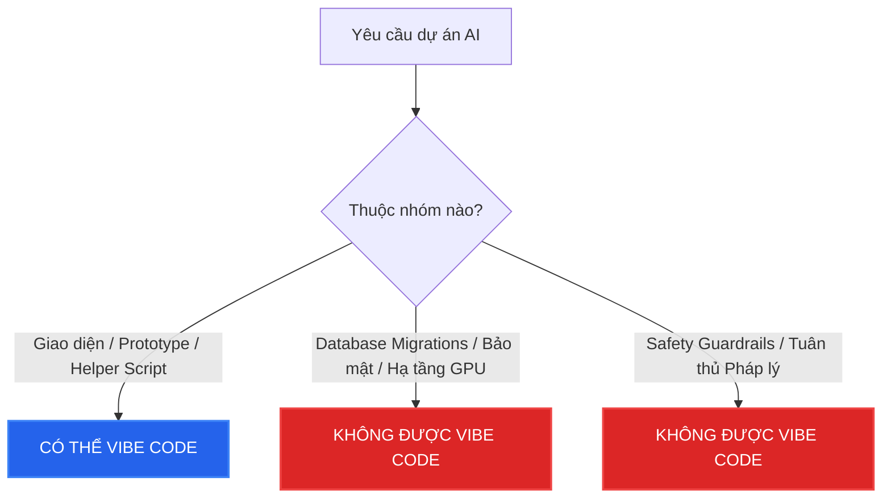

# Cẩm Nang Kỹ Sư AI: Nên và Không Nên "Vibe Code" Trong Kỷ Nguyên Hạ Tầng AI (2026)

**"Vibe Coding"** là thuật ngữ mô tả phương thức lập trình hiện đại bằng cách sử dụng ngôn ngữ tự nhiên để hướng dẫn các AI Agent (như Cursor, Antigravity, Claude Engineer) tự động sinh và ghép mã nguồn, thay vì kỹ sư phải tự tay gõ từng dòng lệnh cú pháp. 

Tuy nhiên, trong thế giới **Hạ tầng AI và Hệ thống Production lớn (Track 2: Days 16–28)**, việc phó mặc hoàn toàn cho cảm xúc ("vibe") của AI có thể dẫn đến thảm họa sập hệ thống, rò rỉ dữ liệu hoặc hóa đơn đám mây khổng lồ. 

Dưới đây là bản đồ chỉ đường giúp bạn phân biệt: **Cái gì có thể Vibe** và **Cái gì bắt buộc phải Kỹ trị (Deterministic Engineering)**.

---

## 🎯 Phần 1: Những Thứ CÓ THỂ "Vibe Code" (Vibe-able Areas)
*AI đặc biệt xuất sắc trong việc hiện thực hóa các ý tưởng có tính chất thị giác, cấu trúc lặp đi lặp lại hoặc các tác vụ thử nghiệm độc lập.*

### 1. Tạo bản thử nghiệm nhanh (Rapid Prototyping & UI/UX)
* **Ví dụ**: Giao diện HTML/CSS/JS của trang Slide thuyết trình tương tác, các Dashboard hiển thị log của Agent, trang demo sản phẩm cho nhà đầu tư (Pitching).
* **Tại sao**: Lỗi ở đây không gây chết hệ thống (non-destructive). AI có khả năng phối màu, dựng layout CSS và tạo tương tác rất nhanh dựa trên các best-practice có sẵn.

### 2. Mã nguồn mẫu & Kịch bản bổ trợ (Boilerplate & Helper Scripts)
* **Ví dụ**: Script Python để đọc dữ liệu từ tệp PDF rồi trích xuất thành văn bản, code gọi API đơn giản, script chuyển đổi định dạng JSON sang Parquet.
* **Tại sao**: Các tác vụ này có logic tuyến tính, dễ kiểm thử bằng mắt và không chứa các trạng thái (stateless) phức tạp của hệ thống.

### 3. Bản thảo cấu trúc hạ tầng (Draft Infrastructure-as-Code)
* **Ví dụ**: Dựng file template `.tf` (Terraform) cơ bản để khai báo cụm ECS, viết khung Dockerfile, cấu hình kịch bản CI/CD ban đầu.
* **Tại sao**: Bạn có thể dùng AI để sinh khung (boilerplate), nhưng sau đó **bắt buộc** phải rà soát thủ công các thông số bảo mật và tài nguyên.

---

## ⚠️ Phần 2: Những Thứ TUYỆT ĐỐI KHÔNG Được "Vibe Code" (Non-Vibe-able)
*Những khu vực này đòi hỏi tính chính xác tuyệt đối (Deterministic). Một sai sót nhỏ của AI có thể dẫn đến mất dữ liệu vĩnh viễn, vi phạm pháp luật hoặc sập hạ tầng.*

### 1. Cơ sở dữ liệu & Cấu trúc dữ liệu (Data Migrations & Data Contracts)
* **Nguy cơ**: Nếu bạn để AI tự viết và chạy các tệp Migration cơ sở dữ liệu (ví dụ: Alembic, SQL), AI có thể vô tình chạy lệnh `DROP COLUMN` hoặc làm mất đồng bộ khóa ngoại gây mất dữ liệu sản xuất.
* **Quy tắc**: **Data Contracts** (ODCS v3) giữa các luồng Ingestion (Flink/Kafka) và Lakehouse (Apache Iceberg) phải được thiết kế và duyệt bởi kỹ sư dữ liệu (Data Engineer). Không được "vibe" schema của dữ liệu lớn.

### 2. Bảo mật, Phân quyền & Tuân thủ Pháp lý (Security & Compliance)
* **Nguy cơ**: AI không hiểu sâu sắc về luật pháp hiện hành. Để AI tự viết chính sách phân quyền IAM, cấu hình khóa SSH hoặc kiểm tra tính tuân thủ của Nghị định bảo vệ dữ liệu cá nhân **PDPL 91/2025/NĐ-CP** và **Luật AI VN 134/2025** sẽ tạo ra các lỗ hổng bảo mật nghiêm trọng.
* **Quy tắc**: Việc thiết lập Evidence Trails (nhật ký thử nghiệm) để tránh tội hình sự (Điều 198 BLHS về lừa dối khách hàng) phải được thiết lập theo quy trình kiểm duyệt (Rituals) nghiêm ngặt của doanh nghiệp.

### 3. Tối ưu hóa GPU & Tham số Serving (Performance Tuning)
* **Nguy cơ**: AI thường cấu hình bừa bãi các tham số chạy như KV Cache size trong vLLM, RadixAttention tree depth trong SGLang hoặc kích thước phân mảnh vGPU/MIG. Việc này dẫn đến lỗi Out-Of-Memory (OOM) hoặc làm giảm 50% hiệu suất GPU của server hàng chục ngàn USD.
* **Quy tắc**: Các chỉ số hạ tầng phải được tính toán dựa trên kiểm thử hiệu năng (Benchmarking) thực tế, không dựa vào phỏng đoán của AI.

### 4. Hệ thống phòng thủ an toàn (Guardrails & Safety Gates)
* **Nguy cơ**: Viết quy luật an toàn bằng Colang (trong NeMo Guardrails) đòi hỏi cấu trúc máy trạng thái (State Machine) cực kỳ chặt chẽ để chặn đứng tấn công Jailbreak. AI sinh code Colang rất dễ bị lỗi logic dẫn đến rò rỉ API Key hoặc hệ thống trả lời các nội dung độc hại.
* **Quy tắc**: Từng luồng kiểm duyệt đầu vào (Input Gate) và đầu ra (Output Gate) phải được review thủ công từng dòng code.

### 5. Bộ dữ liệu đánh giá (EDD Test Sets)
* **Nguy cơ**: Bạn không thể "vibe code" bộ Test set dùng để chấm điểm ứng dụng (như các metric của DeepEval, Ragas). Nếu bộ dữ liệu kiểm thử được sinh hoàn toàn tự động bằng AI mà không có sự kiểm duyệt của chuyên gia ngành (Domain Expert), bạn sẽ gặp hiện tượng **AI-evaluation bias** (AI tự chấm điểm tốt cho chính mình nhưng thực tế ứng dụng chạy rất tệ).

---

## 💡 Phần 3: Ma Trận Đối Chiếu Chi Tiết

| Hạng mục công việc | Vibe Code (AI sinh hoàn toàn) | Kỹ trị (Kỹ sư kiểm soát 100%) | Lời khuyên thực chiến |
| :--- | :---: | :---: | :--- |
| **Dựng UI Demo/Presentation** | ✅ | ❌ | Tiết kiệm 95% thời gian bằng cách ra lệnh cho AI. |
| **Viết Regex lọc từ khóa thô** | ✅ | ❌ | AI viết Regex rất nhanh, chỉ cần test lại vài trường hợp. |
| **Cấu hình NeMo Guardrails** | ❌ | ✅ | Bắt buộc viết tay mã nguồn Colang để đảm bảo luồng hội thoại chặt chẽ. |
| **Database Schema & Migration**| ❌ | ✅ | AI chỉ được viết bản nháp, kỹ sư bắt buộc duyệt và test trên Sandbox trước khi deploy. |
| **Tính toán ROI & Cost Model** | ❌ | ✅ | Cần bảng Excel/Code Python với các con số chính xác tuyệt đối, không được đoán mò. |
| **Sinh Test-cases giả lập** | ✅ | ❌ | Dùng AI tạo 1000 câu hỏi giả lập (noise, adversarial) để stress test hệ thống. |
| **Cấu hình quyền IAM & SSL** | ❌ | ✅ | Chỉ một sai sót nhỏ của AI có thể làm lộ toàn bộ bucket S3 chứa dữ liệu khách hàng. |

---

## 🔑 Nguyên Tắc Vàng Để Sinh Tồn Trong Kỷ Nguyên Vibe Coding

1. **"Code-as-Spec" (Viết Test trước khi Vibe)**: Trước khi ra lệnh cho AI viết code, hãy tự tay viết các đoạn mã Unit Test hoặc định nghĩa rõ ràng thế nào là một kết quả đúng (Assert). Điều này giúp bạn kiểm soát được AI khi nó sinh code bị ảo giác.
2. **Sandbox Isolation**: Tuyệt đối không cho phép các AI Agent chạy mã nguồn trực tiếp trên môi trường Production hoặc database thật. Hãy chạy trên môi trường Docker cục bộ (Local Sandbox).
3. **Hiểu rõ cấu trúc tài nguyên**: Bạn có thể "vibe" để viết nhanh một ứng dụng RAG, nhưng bạn phải biết rõ dưới hạ tầng đang gọi bao nhiêu token, có bật Prompt Caching chưa, và DB đang sử dụng thuật toán index HNSW hay IVF-PQ. Sự hiểu biết về hạ tầng sẽ bảo vệ bạn khỏi những hóa đơn đám mây đắt đỏ.
